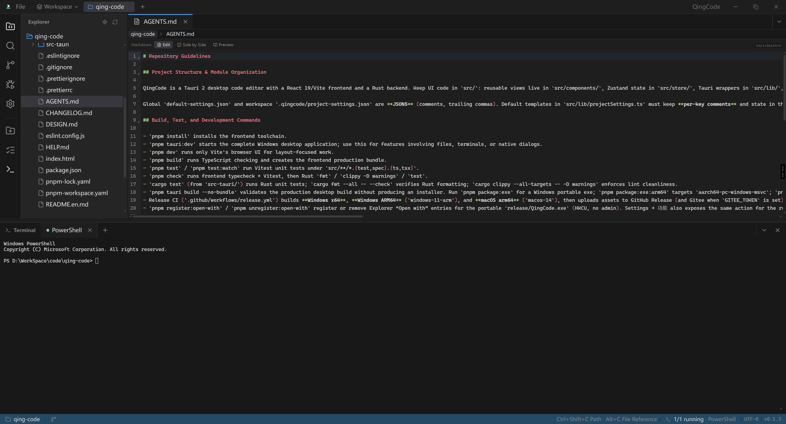
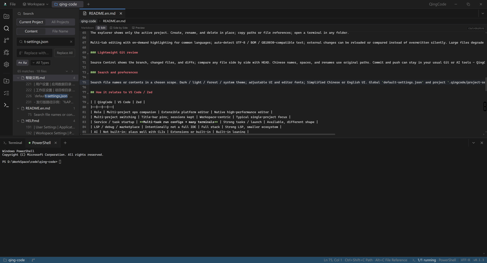
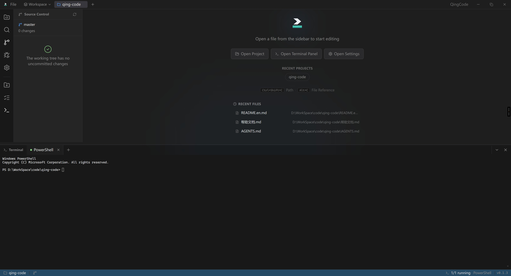
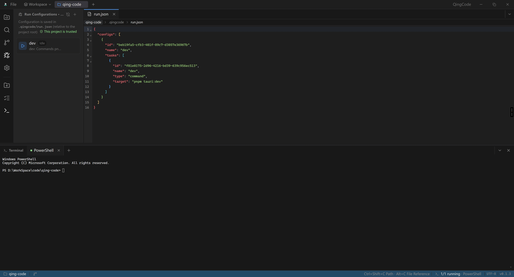
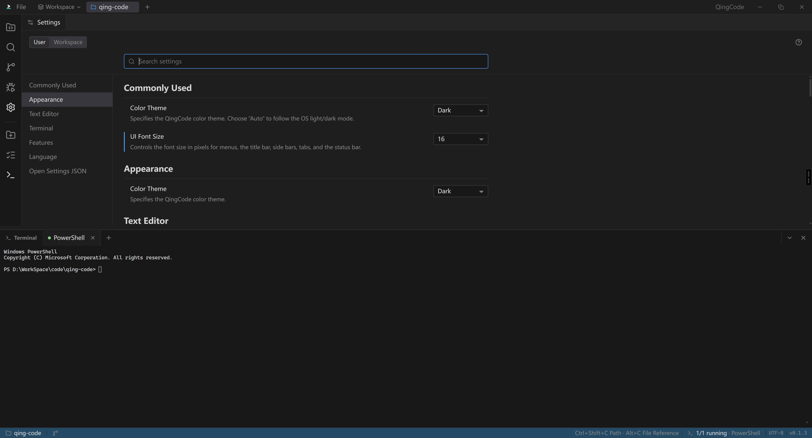
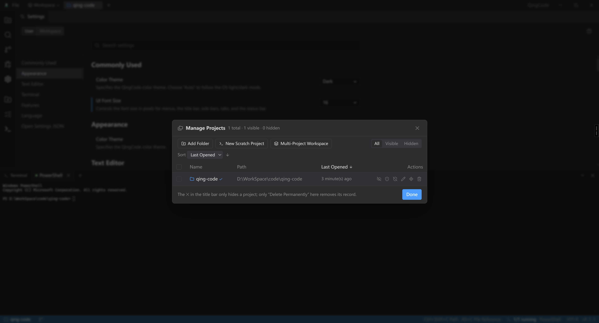

# QingCode

[中文](./README.md)

**QingCode** is a **project-management companion for the AI coding era** on Windows: multi-project switching, service startup, terminal sessions, and light editing in one window.  
It is not another VS Code or Zed — it focuses on keeping several local projects and their processes under control.

## Screenshots

### Explorer & editor



### Search



### Source Control



### Run configurations



### Settings



### Manage projects



## Why QingCode

Coding increasingly happens alongside AI tools (Cursor, Claude, OpenCode, and others). What often slows you down is not “missing a heavier IDE”, but:

- Several local repos open at once, with context lost every time you switch windows  
- Each project needs a stack of services (API, web, workers, proxies…) that are easy to forget and hard to keep tidy in terminals  
- AI assistants, scripts, and local processes stay fragmented while project ops stay manual  

QingCode puts weight on **project ops and the running scene**: pin many projects, keep terminals with each project, and start services with run configurations. Editing, search, and Git review are enough to stay oriented; deep language intelligence stays with the AI tools you already use.

## What you get

### Multi-project switching

Pin folders in the title bar and switch with a click. Each project keeps its own file tree and terminals; leaving a project does not wipe unsaved buffers or terminal sessions. Overflow stays reachable, and you can save named multi-project workspaces.

### Run configurations: start project services

This is a core QingCode workflow. Define run configurations per project (stored in `.qingcode/run.json`):

- One configuration can hold multiple tasks (command / script / ps1 / bat / sh)  
- On launch, **each task opens its own terminal** — ideal for API + web + worker side by side  
- Per-task working directory and environment variables; stop a whole configuration at once  
- Unknown projects start restricted; trust is required before editing, running scripts, or using the terminal  

Typical loop: open a project → start a run configuration → services land in separate terminals → edit code or hand a terminal to an AI CLI.

### Terminal profiles: default shells and AI / tool entry points

Alongside run configurations, manage **terminal profiles** (name + startup command):

- Default PowerShell, or jump straight into a custom environment  
- Save common AI / dev CLIs (for example `opencode`) as profiles and pick them from the terminal “+” menu  
- Terminals default to the project root; switching projects does not close existing ones  

Run configurations answer “how do this project’s services start?”; terminal profiles answer “what should this shell open with?” — together they keep the local multi-project scene in one place.

### Working with AI: external assistants, no built-in model

QingCode **does not ship** a chat model or agent. Intelligence stays with Cursor / Claude / OpenCode and similar tools; QingCode focuses on projects and the running scene:

- **AI CLIs in the terminal**: jump into `opencode` (and others) via terminal profiles; hand run-config terminals to an assistant when useful  
- **Copy into chats**: copy absolute / relative paths or **file references** (with line ranges) from the explorer or editor  
- **QingCode CLI + Skill**: Settings → **AI** → “Copy Skill text” puts an installable Skill description on the clipboard — install it yourself in your agent (e.g. as `SKILL.md`). Agents can drive `QingCode.exe` to list/add projects, edit run configs, and (with the GUI running) switch projects, start/stop runs, grant trust, and open files (JSON on stdout). QingCode **does not** auto-register with any agent  

Typical loop: QingCode manages projects and services → AI edits in a terminal or external IDE → CLI / references reconnect the scene when needed.

### Focused file tree and light editing

The explorer shows only the active project. Create, rename, and delete in place; copy paths, relative paths, file references, or **Copy Files to Clipboard** for Explorer / apps that accept file paste; open a terminal or search in any folder. Gitignored entries stay visible by default (`explorer.excludeGitIgnore` can hide them). Disk changes auto-refresh expanded folders; the toolbar refresh rescans those subtrees as well.

Multi-tab editing with on-demand highlighting for common languages; auto-detect UTF-8 / BOM / GB18030-compatible text; external changes can be reloaded or compared instead of overwritten silently. Large files degrade or open read-only. Editor and terminal sessions restore after restart (opening a project no longer auto-creates an empty terminal).

### Source Control workspace

Opening Source Control fills the main editor area (click again to return to the explorer):

- **Changes**: staged / unstaged groups; stage or unstage one or all files, discard with confirmation, commit staged changes, and pull / push using the configured upstream  
- **History**: browse commits, changed files, and per-file diffs  
- Inline diffs on the right; Chinese names, spaces, and renames use original paths; pull conflicts are surfaced as a banner — resolve markers in the editor  

Branch surgery, rebase, and a full merge UI stay with your usual Git or AI tools.

### Search and preferences

Search file names or contents in a chosen scope; replace stays collapsed until you expand it. Dark / light / forest / system theme; adjustable UI and editor fonts; Simplified Chinese or English UI. Global `default-settings.json` and project `.qingcode/project-settings.json` are **JSON5**; the template states that comments must not be deleted (see [HELP.md · Settings](./HELP.md#settings)).

## How it relates to VS Code / Zed

| | QingCode | VS Code | Zed |
|--|--|--|--|
| Role | Multi-project ops companion | Extensible platform editor | Native high-performance editor |
| Multi-project switching | Title-bar pins; sessions kept | Workspace-centric | Typical single-project focus |
| Service / task startup | **Multi-task run configs → many terminals** | Strong tasks / launch | Available, different shape |
| LSP / debug / marketplace | Intentionally not a full IDE | Full stack | Strong LSP, smaller ecosystem |
| AI | No built-in model; terminal profiles + CLI Skill for external agents | Extensions or built-in | Built-in leaning |

QingCode **deliberately skips** full IntelliSense, a debugger, and an extension marketplace. Keep VS Code / Zed / Cursor for deep editing; use QingCode to manage which projects are open, which services are up, and which terminals are live.

## Typical flow

1. Add several local project folders and pin them in the title bar  
2. Create run configurations for common stacks (for example `dev` = API + web)  
3. Start services in one click; each task gets its own terminal  
4. Enter an AI CLI via a terminal profile, or copy the CLI Skill from Settings for your agent  
5. Switch projects from the title bar — editor and terminal state remain  

## Who it is for

- People who keep several local repos and frequently start/stop services  
- Developers already using AI coding tools who want a steadier local project / process companion  
- Anyone who would rather not launch a full IDE just to switch projects and bring services up  

## Get the app

Download from [GitHub Releases](https://github.com/Fracizz/QingCode/releases) or [Gitee Releases](https://gitee.com/FrancizTest_admin/qing-code/releases) (built by CI on `v*` tags):

| Platform | Arch | Recommended file |
|----------|------|------------------|
| Windows | x64 | `QingCode_*-windows-x64.exe` or `QingCode_*.exe` |
| Windows | ARM64 | `QingCode_*-windows-arm64.exe` |
| macOS | Apple Silicon (arm64) | `QingCode_*-macos-arm64.dmg` or `.zip` |

- Windows: portable exe or NSIS installer (`*-setup.exe`); needs [WebView2](https://developer.microsoft.com/microsoft-edge/webview2/). The installer tries an automatic download first; on failure, Yes opens the bootstrapper download and No opens the product page  
- macOS: unsigned builds may need right-click → Open the first time  

Local packaging (Windows x64 host):

```bash
pnpm install
pnpm package                  # NSIS installer (x64 only)
# pnpm package:exe            # portable single-file exe
# pnpm package:fast           # skip frontend/icons; Rust only
```

Artifacts land in `release/`: `QingCode.exe` (portable), `QingCode-setup.exe` (installer). ARM64 / macOS multi-arch builds use `.github/workflows/release.yml`.

## Run from source

Needs Node.js 22+, pnpm 10+, Rust stable; WebView2 on Windows, Xcode CLT on macOS.

```bash
pnpm install
pnpm tauri:dev    # full desktop app
```

See [AGENTS.md](./AGENTS.md) for repo conventions and [HELP.md](./HELP.md) for usage documentation.

## Stack

Tauri 2 · React 19 · TypeScript · Vite · CodeMirror 6 · xterm.js · Zustand · Tailwind CSS · Rust

## License

[MIT](./LICENSE)
