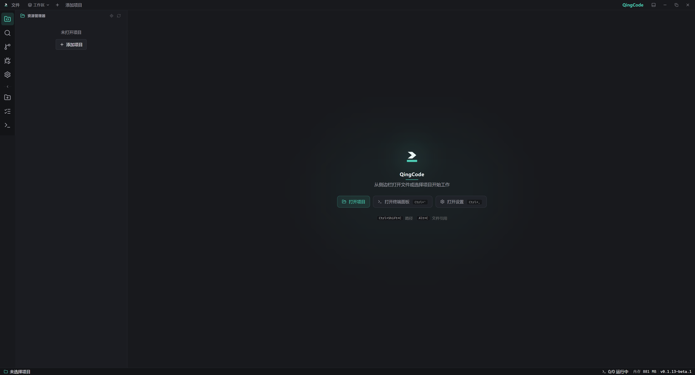
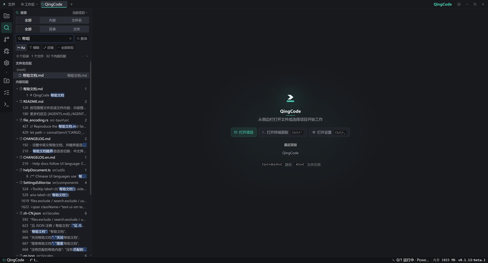
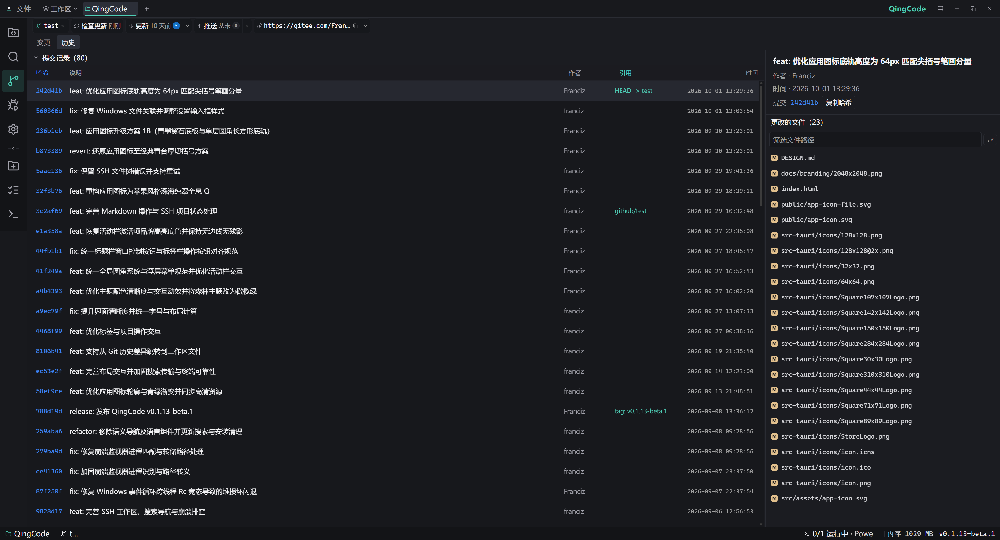
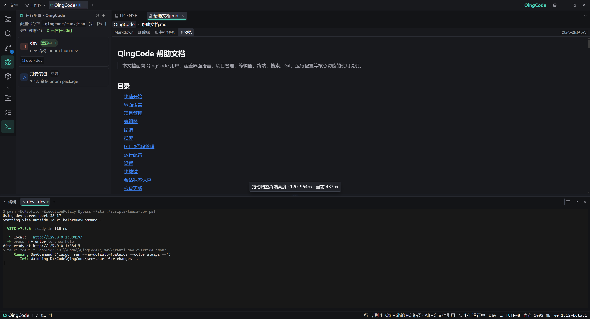
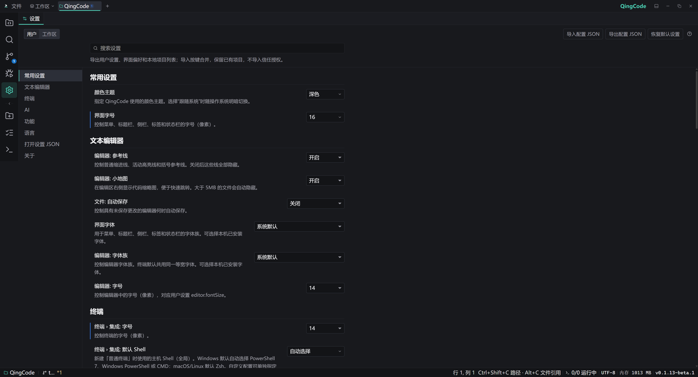
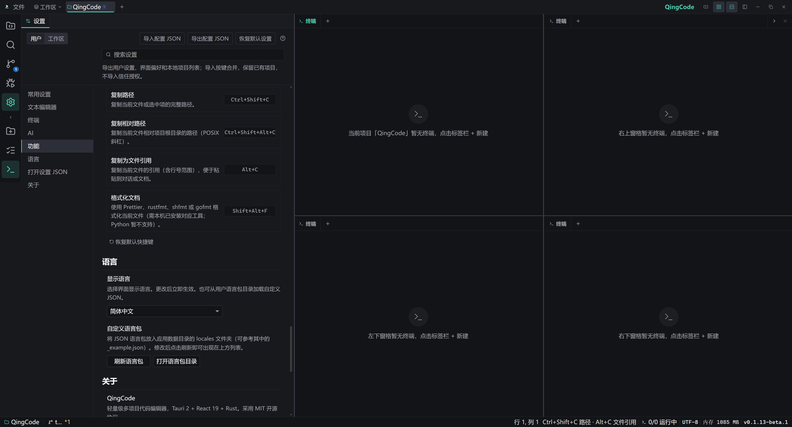
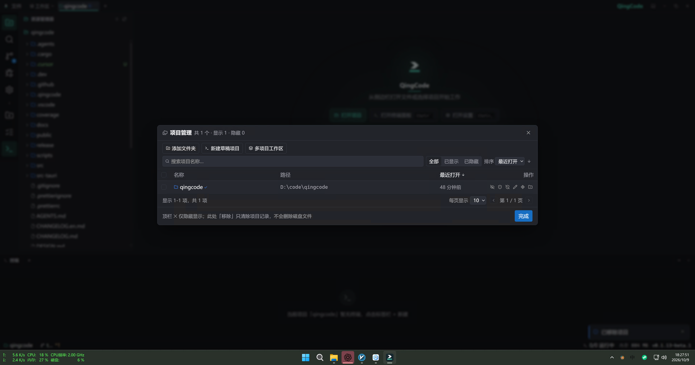

# QingCode

[中文](./README.md)

**QingCode** is a **project-management companion for the AI coding era** on Windows: multi-project switching, service startup, terminal sessions, and light editing in one window.  
It is not another VS Code or Zed — it focuses on keeping local and remote projects and their processes under control.

## Screenshots

These original PNG screenshots show the Simplified Chinese UI; English is also available in Settings. Click an image to view it at full resolution. Version numbers reflect the build used when the screenshots were taken.

### Welcome screen and project entry points

Open projects, terminals, or Settings from the welcome screen; the title bar keeps workspaces and project switching together.

[](./docs/screenshots/zh-01-welcome.png)

### Search

Search directories, file names, and contents within a selected scope, with grouped results and case, fuzzy, suffix, and file-type filters.

[](./docs/screenshots/zh-02-search.png)

### Source Control

Browse commit history, references, and changed files in a full-page workspace; check remote updates, pull, and push from the toolbar.

[](./docs/screenshots/zh-03-source-control.png)

### Run configurations and Markdown preview

Manage run configurations on the left and keep task terminals below; switch Markdown between editing, split preview, and preview only.

[](./docs/screenshots/zh-04-run-config-markdown.png)

### Settings

Manage user and workspace preferences separately, including themes, fonts, and terminal environments; import/export configuration or restore defaults.

[](./docs/screenshots/zh-05-settings.png)

### Four-terminal layout

Arrange terminals in a 2×2 grid alongside Settings or the editor to monitor several services and AI CLIs at once.

[](./docs/screenshots/zh-06-four-terminals.png)

### Manage projects

Search projects by name or path, filter and sort by visibility, and add, hide, or remove project records in one place.

[](./docs/screenshots/zh-07-manage-projects.png)

## Why QingCode

Coding increasingly happens alongside AI tools (Cursor, Claude, OpenCode, and others). What often slows you down is not “missing a heavier IDE”, but:

- Several local and remote repos open at once, with context lost every time you switch windows
- Each project needs a stack of services (API, web, workers, proxies…) that are easy to forget and hard to keep tidy in terminals  
- AI assistants, scripts, and local processes stay fragmented while project ops stay manual  

QingCode puts weight on **project ops and the running scene**: pin many projects, keep terminals with each project, and start services with run configurations. Editing, search, and Git review are enough to stay oriented; deep language intelligence stays with the AI tools you already use.

## What you get

### Multi-project switching

Pin local folders or SSH projects in the title bar and switch with a click. Each project keeps its own file tree and terminals; leaving a project does not wipe unsaved buffers or terminal sessions. Overflow stays reachable, and you can save named multi-project workspaces.

Project management supports name/path search, visible/hidden filters, and sorting. Closing a title-bar project only hides it; Remove clears its project record without deleting files, and the project can be added again later.

### SSH remote workspaces

Use title-bar `+` → **SSH** to connect to a remote host. Confirm its host fingerprint on first use, authenticate, then browse and select the remote project directory. SSH workspaces support SFTP file operations, remote PTY terminals, the Git workspace, local/remote file transfer, and multi-project search mixed with local projects. Workspace trust still gates writes, terminals, and command execution. Remote extensions, port forwarding, and SSH agent forwarding are not currently provided; see [SSH workspaces](./docs/ssh-workspaces.md) for the full capability and boundary list.

### Run configurations: start project services

This is a core QingCode workflow. Define run configurations per project (stored in `.qingcode/run.json`):

- One configuration can hold multiple tasks (command / script / ps1 / bat / sh)  
- On launch, **each task opens its own terminal** — ideal for API + web + worker side by side  
- Per-task working directory and environment variables; stop a whole configuration at once  
- Each configuration can opt in to project-session restore; it is off by default, while opting in restores and restarts linked terminals after an app restart
- Unknown projects start restricted; trust is required before editing, running scripts, or using the terminal  

Typical loop: open a project → start a run configuration → services land in separate terminals → edit code or hand a terminal to an AI CLI.

### Terminal profiles: default shells and AI / tool entry points

Alongside run configurations, manage **terminal profiles** (name + startup command):

- Default PowerShell, or jump straight into a custom environment  
- Save common AI / dev CLIs (for example `opencode`) as profiles and pick them from the terminal “+” menu  
- Terminals default to the project root; switching projects does not close existing ones  

Run configurations answer “how do this project’s services start?”; terminal profiles answer “what should this shell open with?” — together they keep local and remote project sessions in one place.

### Panel layout: classic bottom dock or side columns

The title bar has a **panel layout** menu (also cycled by shortcut). The default is **Classic** (terminal at the bottom). Side-dock presets:

| Layout | What you get |
|------|------|
| Classic (terminal at bottom) | Editor first; drag terminal height |
| Terminal + Editor | Side single terminal \| editor (~1:1 by default) |
| Dual Terminals + Editor | Term A \| Term B \| editor (~1:1:1); both splits drag (~10%–90%) |

Each pane has its own tab strip, with an overflow menu when tabs don’t fit. In a side layout, title-bar icons left of the layout picker toggle dual terminals, a draggable 2×2 quad-terminal grid, or the editor. Opening a file / Source Control / Settings shows the editor column without turning dual or quad terminals off.

### Working with AI: external assistants, no built-in model

QingCode **does not ship** a chat model or agent. Intelligence stays with Cursor / Claude / OpenCode and similar tools; QingCode focuses on projects and the running scene:

- **AI CLIs in the terminal**: jump into `opencode` (and others) via terminal profiles; hand run-config terminals to an assistant when useful  
- **Copy into chats**: copy absolute / relative paths or **file references** (with line ranges) from the explorer or editor  
- **QingCode CLI + Skill**: Settings → **AI** → “Copy Skill text” puts an installable Skill description on the clipboard — install it yourself in your agent (e.g. as `SKILL.md`). Agents can drive `QingCode.exe` to list/add projects, edit run configs, and (with the GUI running) switch projects, start/stop runs, grant trust, and open files (JSON on stdout). QingCode **does not** auto-register with any agent  

Typical loop: QingCode manages projects and services → AI edits in a terminal or external IDE → CLI / references reconnect the scene when needed.

### Focused file tree and light editing

The explorer shows only the active project. Create, rename, and delete in place; copy paths, relative paths, file references, or **Copy Files to Clipboard** for Explorer / apps that accept file paste; open a terminal or search in any folder. Gitignored entries stay visible by default (`explorer.excludeGitIgnore` can hide them). Disk changes auto-refresh expanded folders; the toolbar refresh rescans those subtrees as well.

Multi-tab editing with on-demand highlighting for common languages; auto-detect UTF-8 / BOM / GB18030-compatible text; external changes can be reloaded or compared instead of overwritten silently. Large files degrade or open read-only. Editor and terminal sessions restore after restart (opening a project no longer auto-creates an empty terminal).

File navigation includes `Ctrl+P` to find files by name, `Ctrl+Shift+F` for text search, `Ctrl+G` to go to a line, and `Alt+Left` / `Alt+Right` to navigate back / forward. `Ctrl+Shift+O` opens the current file's functions, classes, or headings. Search results open at the matching line and column.

QingCode focuses on multiple projects, SSH, file editing, and terminal workflows. Neither local nor SSH workspaces provide semantic definition navigation, find usages, or workspace symbol search, and no background semantic index runs. The editor provides syntax highlighting, folding, and the current file outline without separate navigation language components. Use a full IDE such as IntelliJ IDEA or PyCharm for type analysis, refactoring, and debugging.

### Source Control workspace

Opening Source Control fills the main editor area (click again to return to the explorer):

- **Changes**: staged / unstaged groups; stage or unstage one or all files, discard with confirmation, commit staged changes, check remote updates (fetch), and pull / push using the configured upstream
- **History**: browse commits, changed files, and per-file diffs  
- Inline diffs on the right; Chinese names, spaces, and renames use original paths; pull conflicts are surfaced as a banner — resolve markers in the editor  

Branch surgery, rebase, and a full merge UI stay with your usual Git or AI tools.

### Search and preferences

Search file names or contents in a chosen scope; replace stays collapsed until you expand it. Dark / light / forest / system theme; adjustable UI and editor fonts; Simplified Chinese or English UI. Global `default-settings.json` and project `.qingcode/project-settings.json` are **JSON5**; the template states that comments must not be deleted (see [HELP.md · Settings](./HELP.md#settings)).

### Configuration transfer and default reset

The Settings toolbar imports/exports configuration JSON or restores defaults for the selected user or workspace scope. User exports include global settings, interface preferences, shortcuts, terminal profiles, and local project lists; workspace exports contain only that project's overrides. Imports merge settings by key, preserve JSON5 comments, and merge local projects by path. SSH credentials, trust grants, and session data are excluded from exports.

The interface, QingCode CLI, and AI CLI Skill share the same transfer flow. CLI commands include `settings export`, `settings import`, and `settings reset --yes`. Resetting user settings preserves project records; resetting workspace settings restores inheritance from user settings. See [configuration transfer](./docs/settings-transfer.md) for formats and commands.

## Everyday use: compared with IDEA, VS Code, and Zed

| Everyday scenario | QingCode | IDEA | VS Code | Zed |
|--|--|--|--|--|
| Best for | Coordinating multiple projects, services, and terminals | Deep development, refactoring, and debugging | General development assembled through extensions | Fast editing and LSP-based development |
| When switching projects | Title-bar pins; editor and terminal sessions stay live | Project / window centered | Workspace centered | Workspace centered |
| Code navigation | File search, text search, current file outline, and back / forward; no semantic navigation or find usages | Compiler-grade semantics, refactoring, and debugging | Mostly depends on language servers and extensions | Mostly depends on language servers |
| Extensions and AI | No marketplace or built-in model; terminal + CLI connect external assistants | Plugin ecosystem and AI plugins | Broadest extension ecosystem | Built-in-AI leaning, smaller ecosystem |

A typical pairing: start API, web, and workers in QingCode and keep the scene while switching projects; open the same repository in IDEA, VS Code, or Zed when you need type inference, refactoring, or breakpoint debugging. QingCode **deliberately skips** full IntelliSense, a debugger, and an extension marketplace.

## Typical flow

1. Add several local folders or SSH projects and pin them in the title bar
2. Create run configurations for common stacks (for example `dev` = API + web)  
3. Start services in one click; use dual terminals or the 2×2 quad-terminal grid for several output streams
4. Enter an AI CLI via a terminal profile, or copy the CLI Skill from Settings for your agent
5. Switch projects from the title bar — editor and terminal state remain

## Who it is for

- People who keep several local repos and frequently start/stop services  
- Developers already using AI coding tools who want a steadier local project / process companion  
- Anyone who would rather not launch a full IDE just to switch projects and bring services up  

## Get the app

Download from [GitHub Releases](https://github.com/Fracizz/QingCode/releases) or [Gitee Releases](https://gitee.com/FrancizTest_admin/qing-code/releases) (built by CI on `v*` tags):

| Platform | Arch | Recommended file |
|----------|------|------------------|
| Windows | x64 | `QingCode_*-windows-x64-setup.exe` (recommended) or portable `.exe` |
| Windows | ARM64 | `QingCode_*-windows-arm64.exe` |
| macOS | Apple Silicon (arm64) | `QingCode_*-macos-arm64.dmg` or `.zip` |

- Windows: portable exe or NSIS installer (`*-setup.exe`); needs [WebView2](https://developer.microsoft.com/microsoft-edge/webview2/). The installer tries an automatic download first; on failure, Yes opens the bootstrapper download and No opens the product page. Upgrades remove retired navigation component files while preserving any additional files stored in those directories.
- macOS: unsigned builds may need right-click → Open the first time  

Local packaging (Windows x64 host):

```bash
pnpm install
pnpm package                  # NSIS installer (x64 only)
# pnpm package:exe            # portable single-file exe
# pnpm package:fast           # skip frontend/icons; Rust only
```

Artifacts land in `release/`: `QingCode.exe` (portable), `QingCode-setup.exe` (installer). ARM64 / macOS multi-arch builds use `.github/workflows/release.yml`.

## Run from source

Needs Node.js 22+, pnpm 10+, Rust stable; WebView2 on Windows, Xcode CLT on macOS.

```bash
pnpm install
pnpm tauri:dev    # full desktop app
```

See [AGENTS.md](./AGENTS.md) for repo conventions and [HELP.md](./HELP.md) for usage documentation.

## Stack

Tauri 2 · React 19 · TypeScript · Vite · CodeMirror 6 · xterm.js · Zustand · Tailwind CSS · Rust

## License

[MIT](./LICENSE)
