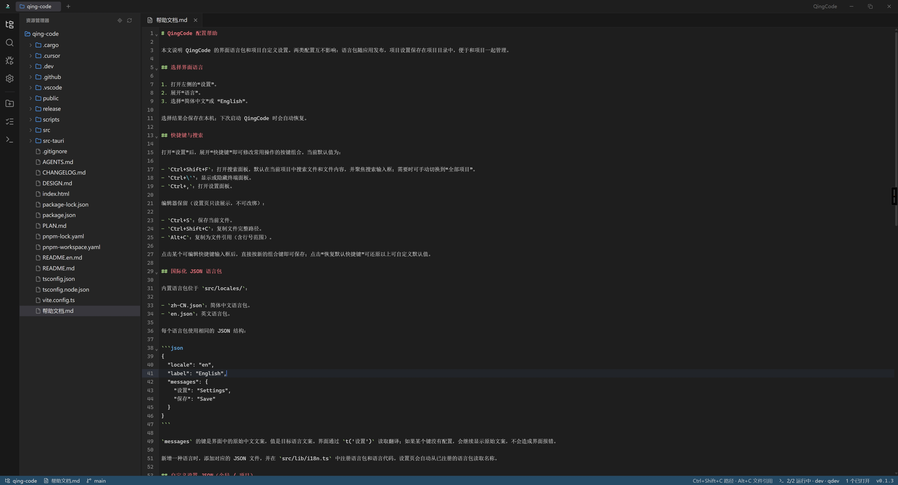
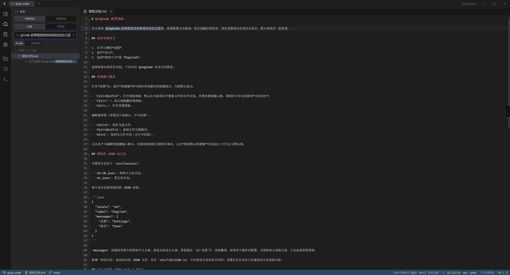
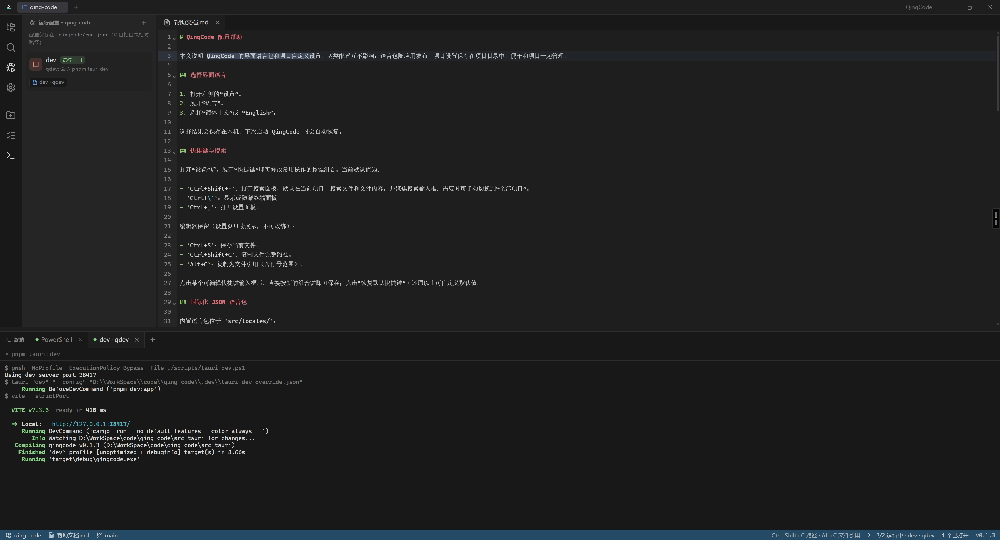
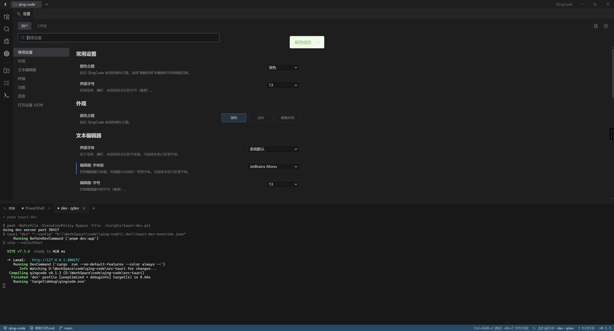

# QingCode

[English](./README.en.md)

**QingCode** 是 AI 开发时代下的**代码项目管理搭子**：把多项目切换、服务启动、终端现场和轻量编辑放进同一个 Windows 窗口。  
不是再做一个 VS Code / Zed，而是补上「同时盯多个项目、一键拉起前后端与工具链」这件事。

## 界面预览

### 资源管理器与编辑器



### 全局搜索



### 编辑器与终端



### 设置



## 为什么做 QingCode

写代码越来越常和 AI 结对（Cursor、Claude、OpenCode 等），真正拖慢节奏的往往不是「缺一个更重的 IDE」，而是：

- 本地同时挂着好几个仓库 / 业务目录，来回切窗口丢现场  
- 每个项目要起的服务一长串（API、前端、Worker、代理……）命令记不住、终端乱成一团  
- AI 助手、脚本和本机进程各自为政，项目管理仍靠自己拼凑  

QingCode 把重心放在**项目管理与运行现场**：多项目常驻、终端跟项目走、用运行配置一键拉起服务；编辑、搜索、看 Git 差异够用即可，复杂智能交给你已有的 AI 工具。

## 核心能力

### 多项目随手切换

把常用目录钉在标题栏，单击切换。每个项目自带文件树与终端；切走不会清掉未保存缓冲和终端现场。项目多了会自动收纳，也可保存为命名多项目工作区。

### 运行配置：管好项目里的服务启动

这是 QingCode 的核心工作流之一。为每个项目配置一组「运行配置」（保存在 `.qingcode/run.json`）：

- 一个配置可包含多个任务（命令 / 脚本 / ps1 / bat / sh）  
- 一键启动时，**每个任务开一个终端**，适合同时拉起 API、前端、Worker 等  
- 支持工作目录与环境变量；可停止整组配置  
- 陌生项目默认受限，信任后才能编辑、跑脚本和使用终端  

日常用法：打开项目 → 运行配置里点启动 → 服务进各自终端 → 再去改代码或把终端交给 AI CLI。

### 终端配置：默认环境与 AI / 工具入口

除了运行配置，还可管理**终端配置文件**（名称 + 启动命令）：

- 默认用 PowerShell，或一键进入自定义环境  
- 把常用 AI / 开发 CLI（如 `opencode`）写成配置，右键「+」选用  
- 终端默认落在项目根目录；换项目时已有终端不会被关掉  

运行配置管「项目服务怎么起」，终端配置管「这个壳默认跑什么」——两者一起，把本机多项目现场收拢到一处。

### 干净的文件树与轻量编辑

资源管理器只展示当前项目。可在树里新建、重命名、删除，复制路径或文件引用，也可在指定目录打开终端。

多文件标签编辑，常见语言按需高亮；自动识别 UTF-8 / BOM / GB18030 兼容编码；外部改动可分类处理，避免悄悄覆盖。大文件会降级或只读预览。重启后恢复各项目的编辑与终端会话。

### 轻量看 Git 更改

源代码管理显示分支、修改列表和差异，可与 HEAD 并排比较。中文、空格、重命名路径按原始路径读取。提交与推送仍可在你熟悉的 Git / AI 工具里完成——QingCode 先帮你看清改了什么。

### 搜索与定制

按范围搜文件名或文件内容。深色 / 浅色 / 森林 / 跟随系统；界面与代码字体可调；界面语言支持简体中文与 English。全局与项目级设置保存在本机（JSON5，可写注释）。

## 和 VS Code / Zed 的关系

| | QingCode | VS Code | Zed |
|--|--|--|--|
| 定位 | 多项目运行与管理搭子 | 扩展生态平台编辑器 | 原生高性能编辑器 |
| 多项目切换 | 标题栏常驻，切走保留现场 | 偏单工作区 | 一般 |
| 服务 / 任务启动 | **运行配置多任务 → 多终端** | 任务 / launch 很强 | 有，形态不同 |
| LSP / 调试 / 扩展市场 | 不做重 IDE | 完整 | 强 LSP，生态更小 |
| AI | 不内置，方便外挂 CLI / 助手 | 扩展或内置 | 内置向 |

QingCode **刻意不做**完整 IntelliSense、调试器和插件市场；你继续用 VS Code / Zed / Cursor 写深逻辑，用 QingCode 管「今天要开哪些项目、哪些服务、哪些终端」。

## 典型用法

1. 添加几个本地项目目录，钉在标题栏  
2. 为常用项目写好运行配置（例如 `dev` = API + Web）  
3. 需要时一键启动服务，终端按任务分开  
4. 用终端配置快速进入 AI CLI 或项目脚本环境  
5. 在标题栏切到下一个项目——编辑与终端状态仍在  

## 适合谁

- 同时维护多个本地仓库，又要经常起停服务的人  
- 已经在用 AI 编程工具，需要一个更稳的本机项目 / 进程搭子  
- 不想为「切项目 + 起服务」再开一整套重型 IDE 的人  

## 获取应用

从 [GitHub Releases](https://github.com/Fracizz/QingCode/releases) 或 [Gitee Releases](https://gitee.com/FrancizTest_admin/qing-code/releases) 下载（打 `v*` 标签后由 CI 构建）：

| 平台 | 架构 | 推荐文件 |
|------|------|----------|
| Windows | x64 | `QingCode_*-windows-x64.exe` 或 `QingCode_*.exe` |
| Windows | ARM64 | `QingCode_*-windows-arm64.exe` |
| macOS | Apple Silicon (arm64) | `QingCode_*-macos-arm64.dmg` 或 `.zip` |

- Windows：便携 exe，双击运行；需 [WebView2](https://developer.microsoft.com/microsoft-edge/webview2/)（较新系统通常已预装）  
- macOS：未签名时首次请右键 → 打开；需要 Apple Developer 签名/公证后再分发可跳过该步骤  

本地打包：

```bash
pnpm install
pnpm package:exe              # 当前 Windows 主机架构
pnpm package:exe:arm64        # Windows ARM64（需本机或 CI 的 aarch64 工具链）
pnpm package:macos            # 仅在 macOS 上：Apple Silicon dmg/app
```

产物在 `release/`。完整多架构发布走 GitHub Actions（`.github/workflows/release.yml`）。

## 从源码运行

环境：Node.js 22+、pnpm 10+、Rust stable；Windows 需 WebView2，macOS 需 Xcode CLT。

```bash
pnpm install
pnpm tauri:dev    # 完整桌面应用
```

更多约定见 [AGENTS.md](./AGENTS.md)；设置与语言说明见 [帮助文档.md](./帮助文档.md)。

## 技术栈

Tauri 2 · React 19 · TypeScript · Vite · CodeMirror 6 · xterm.js · Zustand · Tailwind CSS · Rust
